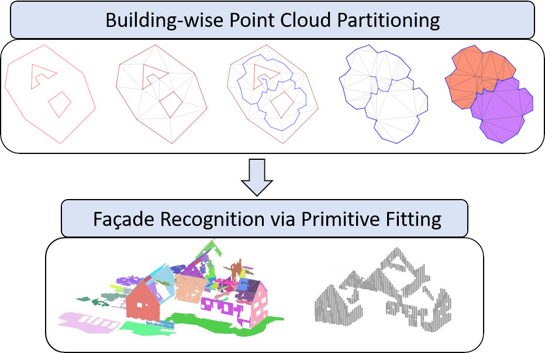

# PBF-FR : Partitioning Beyond Footprints for Façade Recognition in Urban Point Clouds

PBF-FR is a method for the automatic recognition of façades within complex urban scenes represented as point clouds. The algorithm employs an enhanced partitioning strategy that extends beyond strict building footprints by incorporating surrounding buffer zones, allowing for a more complete capture of façade geometry, particularly in dense urban contexts. This is combined with a primitive recognition stage based on the Hough transform, enabling the detection of façade structures. The main steps of the method are described in the paper "PBF-FR: Partitioning Beyond Footprints for Façade Recognition in Urban Point Clouds".



## Clone
The repository includes the submodules necessary to make the code work. Please, clone it recursively:

- Clone recursively the repository into your local machine:
```
git clone --recursive https://github.com/DanielaCabiddu/PBF-FR.git
```

In the following, assume the **${ROOT}** folder to be the one whee this *README* lies.

## Content of the repository
- `src`: source code including the two submodules where the two main steps of the pipeline are implemented
  - `partitioning`: developed in C++ and detailed in Section 4.1 of the paper 
  - `recognition`: developed in MATLAB and detailed in Section 4.2 of the paper 
- `scripts`: scripts necessary to build C++ code and replicate experiments described in the paper

## Build the source code
To build the C++ source code, use the following pipeline:

```
cd ${ROOT}
./scripts/build_all.ps1
```

Binaries will be available in the **${ROOT}/bin** folder

## Other software requirements to make the code work

The MATLAB source code is based on some MATLAB Toolboxes, which must be installed before running the recognition step.

Please, if not yet installed, please consider to make the following toolboxes available:

- LIDAR Toolbox
- Statistics and Machine Learning Toolbox
- Text Analytics Toolbox

## Paper Replicability

The scripts provided in the `${ROOT}/scripts` folder enable full replication of the experimental results described in the paper.

To reproduce the experiments using the **H3D dataset**, run the following PowerShell script:

```powershell
${ROOT}/scripts/run_H3D.ps1
```

<details>
<summary><strong> What the script does </strong> </summary>

This script automates the full experimental pipeline as follows:

1. **Download the input data**  
   The required input data (too large to be included in the repository) is automatically downloaded from the web.

2. **Run the partitioning algorithm**  
   The script executes the partitioning approach described in the paper.  
   During execution, an OpenGL viewer will open to display the result (corresponding to **Figure 4(c)** in the paper).  
   > 🖱️ *Close the OpenGL window to continue.*

3. **Save partitioning results**  
   Partitioned outputs are saved in the following folder:

   ```
   ${ROOT}/PBF-FR-H3D-results
   ```

4. **Execute the facade recognition step**  
   This step is automatically triggered after partitioning completes.  
   The recognition output is saved to:

   ```
   ${ROOT}/src/recognition/output
   ```

5. **Compute and display evaluation metrics**  
   The script runs evaluation routines and prints the computed metrics directly in the PowerShell terminal.

✅ This process reproduces all the steps and results associated with the H3D experiment from the paper. In particular, it provides Figure 4(c) and the results of the quantitative evaluation, that is the value of precision, recall, F1-score, true positives (TP), false positives (FP), false negatives (FN), and true negatives (TN).

</details>


## Author & Copyright

Chiara Romanengo (CNR-IMATI). Contact Email: chiara.romanengo@cnr.it

Daniela Cabiddu (CNR-IMATI). Contact Email: daniela.cabiddu@cnr.it

## Citing us
```bibtex
@article{pbf-fr,
  author       = {Chiara Romanengo, Daniela Cabiddu, Michela Mortara},
  title        = {{PBF-FR: Partitioning Beyond Footprints for Façade Recognition in Urban Point Clouds}},
  year         = {2025 (to appear)},
  journal      = {Computers \& Graphics - Special Issue 3DOR 2025}
}
```

## Acknowledgment

This work was partially supported by the project RAISE – Robotics and AI for Socio-economic Empowerment (project code ECS00000035), funded by the European Union – NextGenerationEU and by the Italian Ministry of University and Research (MUR) under the National Recovery and Resilience Plan (NRRP), Mission 4, Component 2, Investment 1.5, Creation and strengthening of innovation ecosystems for sustainability.

The authors also acknowledge support from the project PON METRO – ASSE 1 – Agenda Digitale, titled Urban Intelligence Science Hub (UISH) for City Network (CUP: B51B21000430001), funded under the Italian National Operational Program for Metropolitan Cities 2014–2020.
